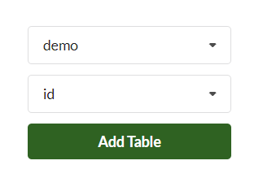
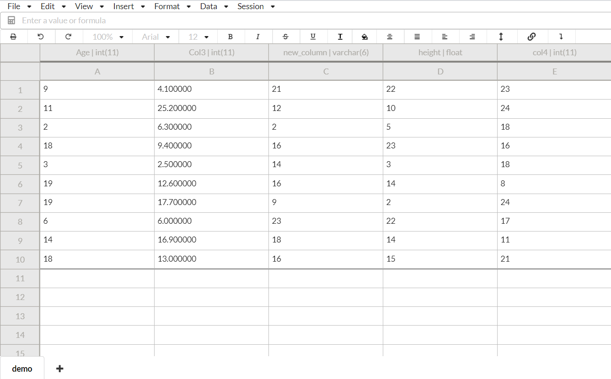

# Getting Started

## Intro

DataSpread Workbench is a new application that combines a fully featured spreadsheet user interface with a powerful database backend. It can be used with your existing SQL databases, but adds all the functionality of a spreadsheet including formula evaluation, multiple simultaneous users, formatting, and a lot more! On top of that, you can use it without modifying your original database at all!

### Key terminology:

* A **DataSpread** is the equivalent of an Excel workbook. It's associated with a SQL database that you provide. It can contain multiple sheets.
* A **Sheet**, as the name implies, is similar to a sheet in Excel. It can be used like a normal spreadsheet, except it can also be optionally backed by an SQL table, in which case the data for the top left area will come from the SQL table.

## Login/Sign Up

When you first visit [dataspread.io](http://www.dataspread.io), you'll be greeted with the following screen. With our simple user management you can register a new account, log in and log out using your own password. In this demo, we will be logged in as a test user.

```bash
# Enter provided username and password to login
Username: testuser
Password: testpassword
```


## Create a DataSpread

After signing up, you will be taken to the dataspreads manager.


Click on the green plus icon in the bottom right corner to create a DataSpread:


First, you'll need to add a set of credentials to connect to your database.

Enter the provided information shown below if you locally deploy dataSpread-Workbench by Docker:

```markdown
Database type: mysql
SQL Host: mysql
SQL Port: 3306
SQL Username: root
SQL Password: dsdemo
```

If you follow the instructions for deploying a development environment of DataSpread-Workbench, enter the following information:

```markdown
Database type: mysql
SQL Host: localhost
SQL Port: 3306
SQL Username: dataspread-user-1
SQL Password: dataspread-pass-1
```


Then select that set of credentials and click on `Next`. You should see a list of databases that can be accessed using those credentials. Select the one you want to use, and also specify a name for your Dataspread. If you follow the instructions for deploying a development environment of DataSpread-Workbench, select `datasprea_local` as the database.


Click on the DataSpread you just created and then add your first sheet by selecting the table you want to associate it with as well as a column from that table that you want to use as the ID. The ID is used to maintain a consistent ordering for the rows \(since SQL tables don't guarantee order by default\).



And that's all! You should see something similar to this:



