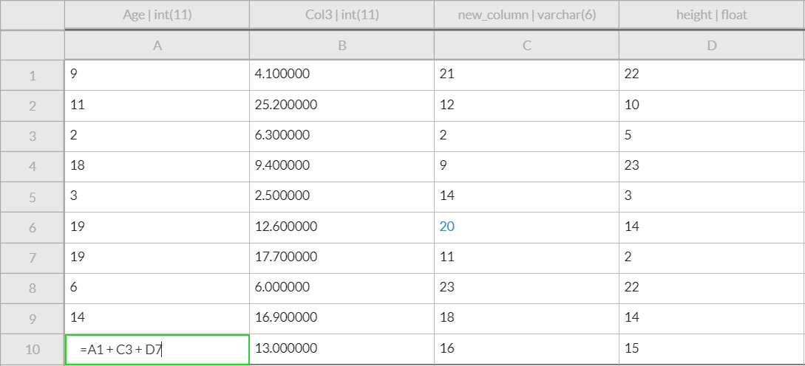

# Formulas

To add a formula, begin editing a cell \(either by double clicking it or using the Formula Bar near the top\) and simply prefix the formula with an `=` sign, e.g. `=5+2` will result in the value `7` in the cell. To reference other cells, use the column label followed by the row label. For example, the very first cell in the sheet \(top left\) can be reference by `A1` . In the following example, we take the sum of 3 different cells:

which results in:

We can also use ranges of cells with the format `A1:B3` where the top left cell of the range and bottom right cell are specified, separated by a colon. The following example takes the average of the values in column A from row 1 to row 4:

Notice how the formula bar at the top always displays the underlying formula for a cell even though the cell itself just displays the evaluated result of the formula \(except when it's being edited\). Several commonly used formulas can be found in top toolbar's insert menu.

