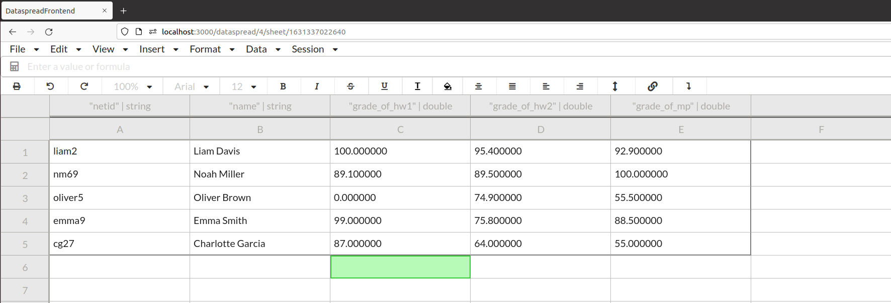
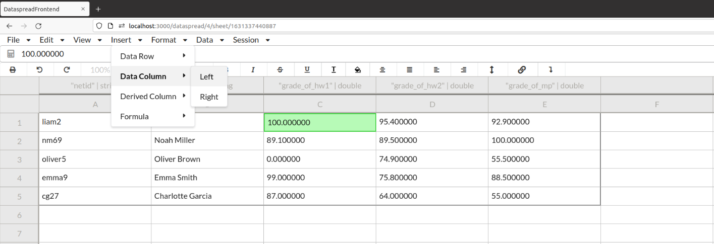
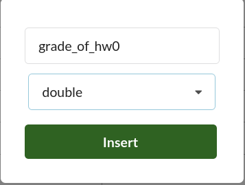
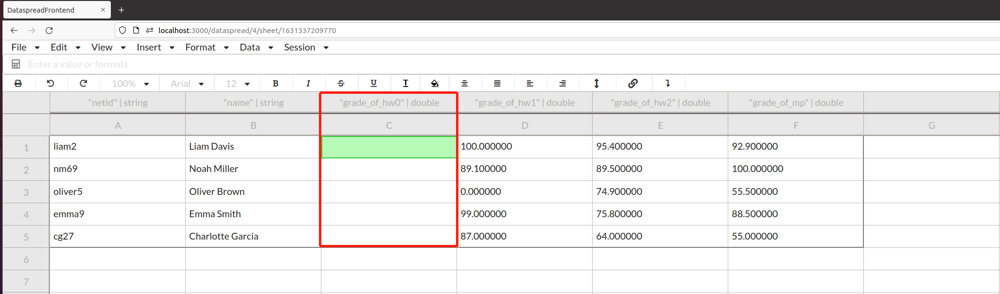
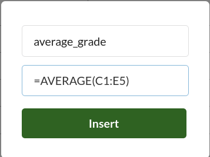

# Insert

Now, let's look at the functions associated with insert.

This is a table used to keep track of student grades. Each row of the table corresponds to a student and is represented by a tuple of five elements. 

| Name | Description |
| :--- | :--- |
| Column A | Student's netid |
| Column B | Student's name |
| Column C | The student's grade of the first assignment |
| Column D | The student's grade of the second assignment |
| Column E | The student's grade of the machine project |

The insert contains four options. Using them wisely will greatly improve the efficiency of adding data.

| Name | Description |
| :--- | :--- |
| Free-Form Row (Data Row) | Insert a blank (Free-Form) row above or below a selected blank cell. Or insert a row of the same type above or below a selected non-blank cell |
| Data Column | Insert a column to the left or right of a selected cell. You must name the column and specify the column type (`int`, `double`, or `string`) |
| Derived Column | Insert a new column to the left or right of the selected cell. The data populated in this newly created column is derived from the formula enter by you |
| Formula | See [Limitation][Limitation] |

Here is a brief demonstration of how to insert a data column.

For some reason, we forgot to record the students' grade of homework 0. Thus, we are going to add a column of double type in our sheet to represent it.

We first need to click on the Left to bring up a popup window. 

Hey, there's a new column up! We can see that the original column C (grade_of_hw1) and the columns to its right are shifted to the right automatically. You can then populate this column with data for later use.

You can also compute average of the grade for your students by using Derived Column as below.

[Limitation]:https://github.com/DataSpread-Workbench/user-guide/blob/master/limitation.md