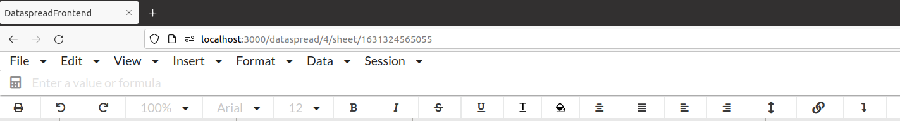
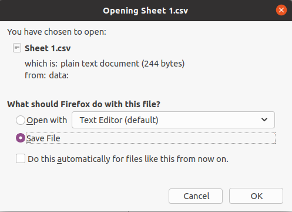
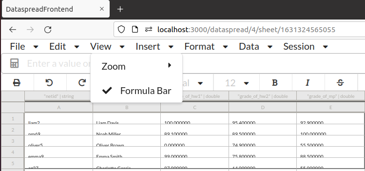
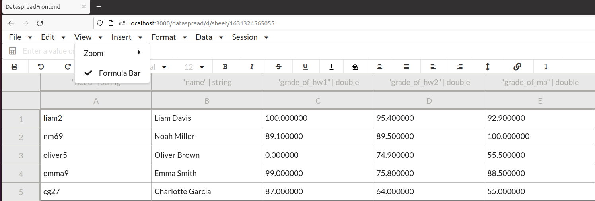
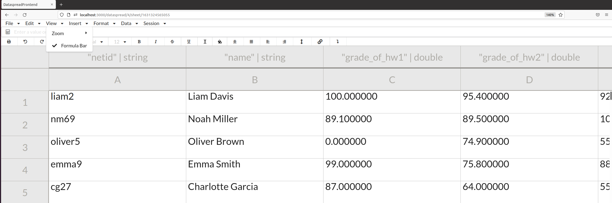
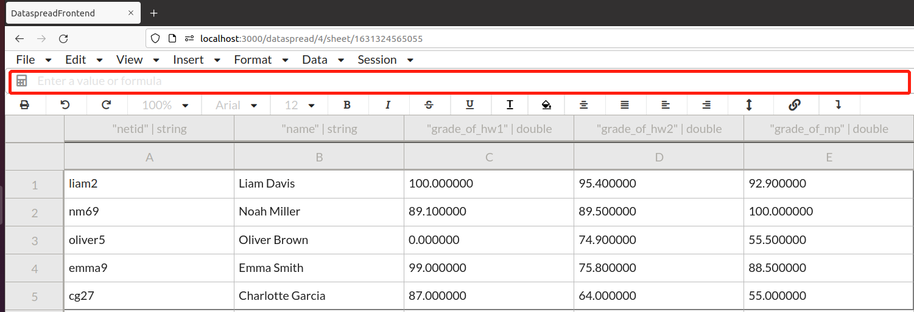

# Other Features

In the upper left-hand corner of the page, you'll see a functionality bar organized into seven categories, as illustrated below.



The following tree summarizes the functionality classified into each category:

```markdown
functionality Bar
├── File
│   ├── New
│   ├── Open
│   ├── Print
│   └── Download as
│       ├── CSV
│       └── PDF
├── Edit
│   ├── Copy
│   ├── Cut
│   ├── Undo
│   ├── Redo
│   ├── Delete Row X
│   └── Delete Column Y
├── View
│   ├── Zoom
│   └── Formula Bar
├── Insert
│   ├── Free-form Row (Data Row)
│   ├── Data Column
│   ├── Derived Column
│   └── Formula
├── Format
│   ├── Bold
│   ├── Italic
│   ├── Underline
│   ├── Strikethrough
│   ├── Font Size
│   ├── Toggle Text Wrap
│   ├── Text Align
│   └── Vertical Align
├── Data
│   ├── Sort by Column X ascending
│   ├── Sort by Column X descending
└── Session
    ├── Close
    └── Log out
```

## File

| Name | Description |
| :--- | :--- |
| New | See [Limitation][Limitation] |
| Open | See [Limitation][Limitation] |
| Print | Creates a PDF from the current view of the DataSpread and opens it in new tab |
| Download as | Download the current view of the DataSpread as csv or pdf |



## Edit

| Name | Description |
| :--- | :--- |
| Copy | Copy the currently selected cell and you can paste the copied cell by Ctrl-V |
| Cut | See [Limitation][Limitation] |
| Undo | Withdraws the most recent operation |
| Redo | Re-run the most recently withdrawn operation |
| Delete Row X | Remove the Xth row from the table, where X indicates the number of rows of the cell that the cursor has selected |
| Delete Column Y | Remove the Yth row from the table, where Y indicates the number of columns of the cell that the cursor has selected |

### View

| Name | Description |
| :--- | :--- |
| Zoom | Zoom in or out to display the entire sheet. |
| Formula Bar | Display the formula bar for entering formula if checked |

Our current options for zooming are 50%, 75%, 90%, 100% (original size), 125%, 150%, and 200%. The following graphs illustrate the effect of a 50%, 100%, and 200%, respectively.

Zoom out 50%:



Original 100%:



Zoom in 200%:



As a good helper for entering formulas, the formula bar will be displayed in the position shown below in the red box.



### Data

| Name | Description |
| :--- | :--- |
| Sort by column X ascending | See [Limitation][Limitation] |
| Sort by column Y ascending | See [Limitation][Limitation] |

### Session

| Name | Description |
| :--- | :--- |
| Close | Close the current Dataspread and redirect the user to the Dataspread Manager |
| Log out | See [Limitation][Limitation] |

[Limitation]:https://github.com/DataSpread-Workbench/user-guide/blob/master/limitation.md