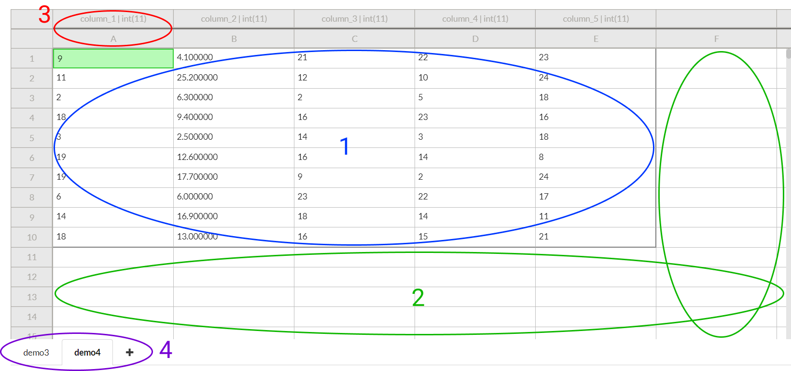
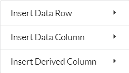
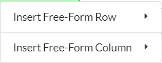
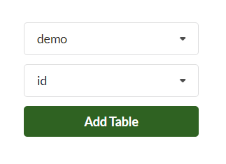

# Sheets

A standard Sheet contains row and column labels on the side and the content area, which is divided into two main sections: `Data` and `Free-Form`. There are also tabs at the bottom to switch between sheets in the DataSpread.

## 1 - Data Area

The top left area in the sheet is where data from the associated SQL table will live. It's bounded by the bolded border and scales automatically based on the number of rows and columns in the SQL table. This section will contain two types of columns:

* **Data Column** — always directly reflects the information in the SQL table. Any modification of cells in this type of column will update the corresponding value in the database. By default, the Data area consists solely of **Data Column**s
* **Derived Column** — applies a formula to another column in the Data area, by cell. For example, if column `A` had the values `1, 2, 3, 4`, then the user can create a new **Derived Column** with say the formula `A*2+1` and the values for that column will be `3, 5, 7, 9` . These values are **not** added in the database, but rather only visible in the DataSpread. These cells also cannot be edited individually.

You can right click on any cell in the Data Area or go to the `Insert` dropdown to add a column. You can also add a `Data Row` which will add a row to the SQL table and reflect it on the sheet.

Note: It's also possible to create a sheet without linking an SQL table, in which case there will be no Data Area. Instead the entire sheet will consist of the Free-Form Area.

## 2 - Free-Form Area

The remaining cells in the sheet are all free-form, meaning that you can enter whatever data you want and use it like a normal spreadsheet. Modifying these cells will have no effect on the SQL table, though you **can** use data from the table in formulas for free-form cells.

When right clicking on any cell in the free-form area, you'll see the option to add a free-form row and/or column:

## 3 - Labels

**Rows:** Each row is numbered starting from 1. The ordering is initially that which is returned from querying the SQL table, but because SQL databases don't guarantee order, the ordering is saved using the ID column you selected as a unique reference to each row. This allows you to reorder rows and insert rows at specific locations. Doing so will not modify anything in the actual database.

**Columns:** Each column is assigned a label starting from `A`. Once you get to `Z`, the next label is `AA`, then `AB`, and so on. In addition to that label, **Data Columns** get an additional label that contains the column name and column type from the SQL table

In formulas, cells can be referenced by column label followed by the row number, for example `C5`

## 4 - Sheet Management

Finally, you can add switch between sheets in the DataSpread by selecting the sheet name or add another sheet by clicking the plus icon. Adding a sheet is exactly the same process as the initial setup \(note that you can create multiple sheets using the same SQL table\):

